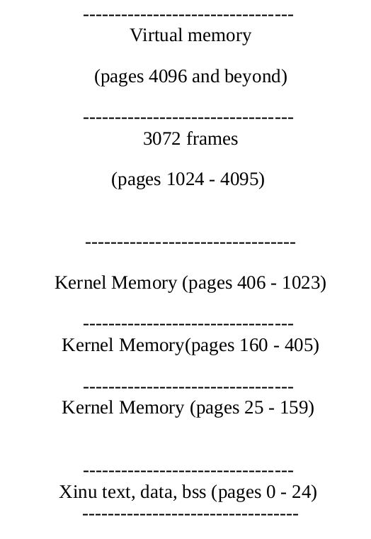
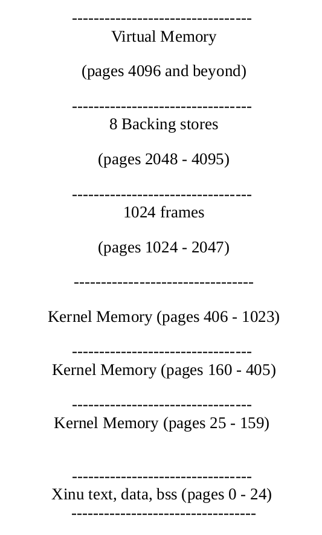
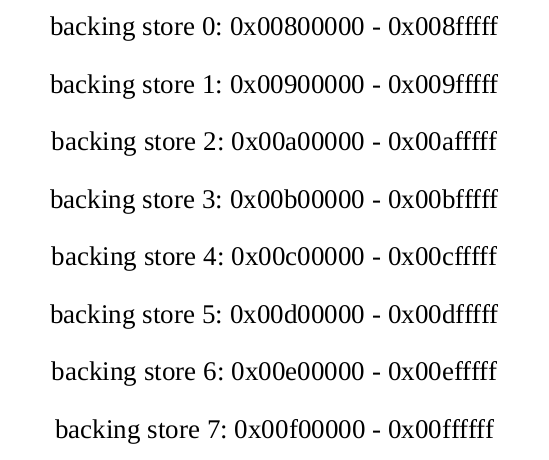
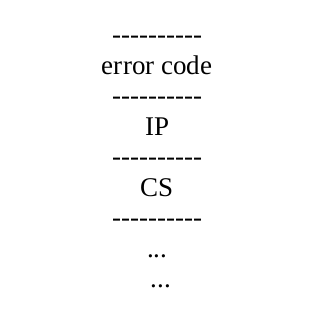

## 1. Introduction
  - Demand paging is a method of mapping a large address space into a relatively small amount of physical memory. It allows a program to
  use an address space that is larger than the physical memory, and access non-contiguous sections of the physical memory in a contiguous
  way. 
  - Demand paging is accomplished by using a "backing store" (usually disk) to hold pages of memory that are not currently in use.

## 2. Goal
  - The goal of this project is to implement the following system calls and their supporting infrastructure.

## 3. System Calls

  - **```SYSCALL xmmap (int virtpage, bsd_t source, int npages) ```**
    - Much like its Unix counterpart (see man ```mmap```), it maps a source file ("backing store" here) of size ```npages``` pages to the virtual page ```virtpage``` . A process may call this multiple times to map data structures, code, etc.
  
  - **```SYSCALL vcreate (int *procaddr, int ssize, int hsize, int priority, char *name, int nargs, long args)```**
    - This call will create a new Xinu process. The difference from ```create()``` is that the process' heap will be private and exist in its virtual memory.
    - The size of the heap (in number of pages) is specified by the user through ```hsize``` .
    - ```create()``` should use ```xmmap()``` . be left (mostly) unmodified. Processes created with ```create()``` should not have a private heap, but should still be able to use ```xmmap()```
    - **```WORD *vgetmem (int nbytes)```**
      - Much like ```getmem()``` , ```vgetmem()``` will allocate the desired amount of memory if possible. The difference is that ```vgetmem()``` will get the memory from a process' private heap located in virtual memory. ```getmem()``` still allocates memory from the regular Xinu kernel heap.
    - **```SYSCALL srpolicy (int policy)```**
      - This function will be used to set the page replacement policy to Second-Chance (SC) or Aging (AGING). You can declare constant SC as 3 and AGING as 4 for this purpose.
    - **```SYSCALL vfreemem (block_ptr, int size_in_bytes)```**
      - You will implement a corresponding ```vfreemem()``` for ```vgetmem()``` call. ```vfreemem()``` takes two parameters and returns OK or SYSERR . The two parameters are similar to those of the original ```freemem()``` in Xinu. The type of the first parameter block_ptr depends on your own implementation.

## 4. Overall Organization
  - The following sections discuss at a high level the organization of the system, the various pieces that need to be implemented in Xinu and how they relate to each other.

  - **Memory and Backing Store**
    - **Backing Stores**
      - Virtual memory commonly uses disk spaces to extend the physical memory. However, our version of Xinu has no file system support. Instead, we will emulate the backing store (how it is emulated will be detailed in 4.1.3). To access the backing store, you need to implement the following functions in the directory paging :
        - ```bsd_t``` - is the type of backing store descriptors. Each descriptor is used to reference a backing store. Its type declaration is in ```paging.h``` . This type is merely ```unsigned int``` .
        - ```int get_bs (bsd_t store, unsigned int npages)``` - requests a new backing store with ID ```store``` of size ```npages``` (in pages, not bytes). If a new backing store can be created, or a backing store with this ID already exists, the size of the new or existing backing store is returned. This size is in pages. If a size of 0 is requested, or the creation encounters an error, SYSERR should be returned.
        Also for practical reasons, ```npages``` should be no more than 256.
        - ```int release_bs(bs_t store)``` releases the backing store with the ID ```store```
        - ```SYSCALL read_bs (char *dst, bsd_t store, int page)``` copies the ```page-th page from the backing store referenced by store to dst . It returns OK on success, SYSERR otherwise. The first page of a backing store is page zero.
        - ```SYSCALL write_bs (char *src, bsd_t store, int page)``` copies a page referenced by src to the page -th page of the backing store referenced by store . It returns OK on success, SYSERR otherwise.
    - **Memory Layout**
      - The basic Xinu memory layout is as follows (page size = 4096 bytes):

      
      - As you can see, our Xinu version compiles to about 100KB, or 25 pages. There is an area of memory from page 160 through the end of page 405 that cannot be used (this is referred to as the "HOLE" in initialize.c ). We will place the free frames into pages 1024 through 4095, giving 3072 frames.
      - The frames will be used to store resident pages, page directories, and page tables. The remaining free memory below page 4096 is used for Xinu's kernel heap (organized as a freelist). ```getmem()``` and ```getstk()``` will obtain memory from this area (from the bottom and top, respectively).
      - All memory below page 4096 will be global. That is, it is usable and visible by all processes and accessible by simply using actual physical addresses. As a result, the first four page tables for every process will be the same, and thus should be shared.
      - Memory at page 4096 and above constitute a process' virtual memory. This address space is private and visible only to the process which owns it. Note that the process' private heap and (optionally) stack are located somewhere in this area.
    - **Backing Store Emulation**
      - Since our version of Xinu does not have file system support, we need to emulate the backing store with physical memory. In particular, consider the following Xinu memory layout:

    
      - A Xinu instance has 16 MB (4096 pages) of real memory in total. We reserve the top 8MB real memory as backing stores. We have 8 backing stores and each backing store maps up to 256 pages (each page is 4K size). As a result, we have the following map between the backing store and the corresponding physical memory range:

    
      - In the implementation, you need to "steal" physical memory frames 2048 - 4095 (take a close look at sys/i386.c , and pay attention to the variables npages and maxaddr ). As a result, this portion of memory will not be used for other purposes
    - **Page Tables and Page Directories**
      - Page tables and page directories (i.e. outer page tables) can be placed in any free frames. For this project you will not be paging either the page tables or page directories. 
      - As page tables are always resident in memory, it is not practical to allocate all potential page tables for a process when it is created (you will, however, allocate a page directory).
      - To map all 4 GB of memory would require 4 MB of page tables! To conserve memory, page tables must be created on-demand. That is, the first time a page is legally touched (i.e. it has been mapped by the process) for which no page table is present, a page table should be allocated.
      - Conversely, when a page table is no longer needed it should be removed to conserve space.
  - **Supporting Data Structures**
    - **Finding the backing store for a virtual address**
      - You may realize that there is a problem - if a process can map multiple address ranges to different backing stores, how does one figure out which backing store a page needs to be read from (or written to) when it is being brought into (removed from) a frame?
      - To solve the problem, you need to keep track of which backing store is allocated when a process is created by vcreate() . Then, a particular page to write/read from can be calculated using its virtual page number within the related store. You may need to declare a new kernel data structure which maps virtual address spaces to backing store descriptors. We will call this the backing store map. It should be a tuple like:
        ```
            { pid, vpage, npages, store }
        ```
      - The function that performs the lookup will look like:
        ```
              f (pid , vaddr)= > {store, pageoffset     within store}
        ```
    - **Inverted Page Table**
      - When writing out a dirty page you may notice the only way to figure out which virtual page and process (and thus which backing store) a dirty frame belongs to would be to traverse the page tables of every process looking for a frame location that corresponds to the frame we wish to write out.
      - This is highly inefficient. To prevent this, we use another kernel data structure, an inverted page table. The inverted page table contains tuples like:

        ```
          { frame number, pid, virtual page number }
        ```
      - if we use an array of size ```NFRAMES``` , the frame number is implicit and just the index into the array. With this structure we can easily find the pid and virtual page number of the page held within any frame i. From that we can easily find the backing store (using the backing store map) and compute which page within the backing store corresponds with the page in frame i. 
  
  - **Process Considerations**
    - **Process Creation**
      - When a process is created we must now also create page directory and record its address. Also remember that the first 16 megabytes of each process will be mapped to the 16 megabytes of physical memory, so we must initialize the process' page directory accordingly.
      - This is important as our backing stores also depend on this correct mapping.
      - A mapping must be created for the new process' private heap and stack , if created with ```vcreate()```
      - As you are limited to 8 backing stores, you may want to use just one mapping for both the heap and the stack (as with the kernel heap), ```vgetmem()``` taking from one end and the stack growing from the other.(Keeping a private stack and paging it is optional, but a private heap must be maintained).

    - **Process Destruction**
      - When a process dies, the following should happen.
        - All frames which currently hold any of its pages should be written to the backing store and be freed.
        - All of its mappings should be removed from the backing store map.
        - The backing stores for its heap (and stack if have chosen to implement a private stack) should be released (remember backing stores allocated to a process should persist unless the process explicitly releases them).
        - The frame used for the page directory should be released.

    - **Context Switching**
      - It should also be clear that now as we switch between processes we must also switch between memory spaces. This is accomplished by adjusting the PDBR register with every context switch.
      - We must be careful, however, as this register must always point to a valid page directory which is in RAM at a page boundary.
      - Think carefully about where you place this switch if you put it in ```resched()``` - before or after the actual context switch.
  
    - **System Initialization**
      -  The NULL process is somewhat of a special case, as it builds itself in the function ```sysinit()```. The NULL process should not have a private heap (like any processes created with ```create()``` ).
      - The following should occur at system initialization:
        - Set the DS and SS segments' limits to their highest values. This will allow processes to use memory up to the 4 GB limit without generating general protection faults. Make sure the initial stack pointer (initsp) is set to a real physical address (the highest physical address) as it is in normal Xinu. See i386.c . And don't forget to "steal" physical memory frames 2048 - 4096 for backing store purposes.
        - Initialize all necessary data structures.
        - Create the page tables which will map pages 0 through 4095 to the physical 16 MB. These will be called the global page tables.
        - Allocate and initialize a page directory for the NULL process.
        - Set the PDBR register to the page directory for the NULL process.
        - Install the page fault interrupt service routine.
        - Enable paging.
  - **The Interrupt Service Routine(ISR)**

    - As you know, a page fault triggers an interrupt 14. When an interrupt occurs the machine pushes CS:IP and then an error code
      
    - It then jumps to a predetermined point, the ISR . To specify the ISR we use the routine:
      ```
        set_evec(int interrupt, (void (*isr)(void))) (see evec.c )
      ```
  - **Faults and Replacement Policies**
    - **Page Fault**
      - A page fault indicates one of two things: the virtual page on which the faulted address exists is not present or the page table which contains the entry for the page on which the faulted address exists is not present. To deal with a page fault you must do the following:
        - Get the faulted address a .
        - Let vp be the virtual page number of the page containing the faulted address.
        - Let pd point to the current page directory.
        - Check that a is a legal address (i.e. that it has been mapped in pd ). If it is not, print an error message and kill the process.
        - Let p be the upper ten bits of a .
        - Let q be the bits [21:12] of a .
        - Let pt point to the p -th page table. If the p -th page table does not exist, obtain a frame for it and initialize it.
        - To page in the faulted page do the following:
          - Using the backing store map, find the store s and page offset o which correspond to vp .
          - In the inverted page table, increase the reference count of the frame that holds pt . This indicates that one more of pt 's entries is marked as "present."
          - Obtain a free frame, f .
          - Copy the page o of store s to f .
          - Update pt to mark the appropriate entry as present and set any other fields. Also set the address portion within the entry to point to frame f.
    - **Obtaining a Free Frame**
      - When a free frame is needed, it may be necessary to remove a resident page from frame. How you pick the page to remove depends on your page replacement policy, The function to find a free page should do the following:

        - Search inverted page table for an empty frame. If one exists stop.
        - Else, Pick a page to replace.
        - Using the inverted page table, get vp , the virtual page number of the page to be replaced.
        - Let a be vp *4096 (the first virtual address on page vp).
        - Let p be the high 10 bits of a . Let q be bits [21:12] of a .
        - Let pid be the pid of the process owning vp .
        - Let pd point to the page directory of process pid .
        - Let pt point to the pid 's p -th page table.
        - Mark the appropriate entry of pt as not present.
        - If the page being removed belongs to the current process, invalidate the TLB entry for the page vp using the invlpg instruction
        - In the inverted page table decrement the reference count of the frame occupied by pt . If the reference count has reached zero, you should mark the appropriate entry in pd as being not present. This conserves frames by keeping only page tables which are necessary.
        - If the dirty bit for page vp was set in its page table you must do the following:
          - Use the backing store map to find the store and page offset within store given pid and a . If the lookup fails, something is wrong. Print an error message and kill the process pid .
          - Write the page back to the backing store.

    - **Page Replacement Policies**
      - I implemented two page replacement algorithms: SC (default) and AGING.
      -For SC , when a frame is allocated for a page, you insert the frame into a circular queue. When a page replacement occurs, SC first looks at the current position in the queue (current position starts from the head of the queue), checks to see whether its reference bit is set (i.e., pt_acc = 1 ).
      - If it is not set, the page is swapped out. Otherwise, the reference bit is cleared, the current position moves to the next page and this process is repeated. If all the pages have their reference bits set, on the second encounter, the page will be swapped out, as it now has its reference bit cleared.
      - For AGING , when a frame is allocated for a page, you insert the frame into a FIFO queue. When a page replacement occurs, you first decrease by half (= one bit shift to the right) the age of each page in the FIFO queue. If a page has been accessed (i.e., pt_acc = 1 ), you add 128 to its age (255 is the maximum age).
      - Then, a page with the youngest age will be replaced first. If more than one page have a common smallest value, a page that is closest to FIFO queue header, i.e. the oldest page among them in memory, will be used for replacement.
      - Default page replacement policy should be SC ; srpolicy(AGING) will be called in main() to switch the replacement policy from SC to AGING .
      - When srpolicy(SC) or srpolicy(AGING) is called, your program should turn on a debugging option, so that when replacements occur, it will print ONLY the replaced frame numbers (not addresses) for grading.


   
    